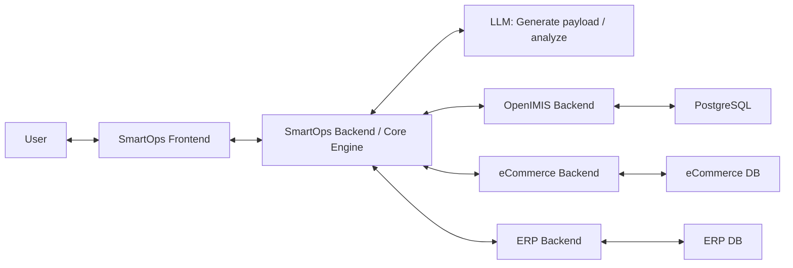
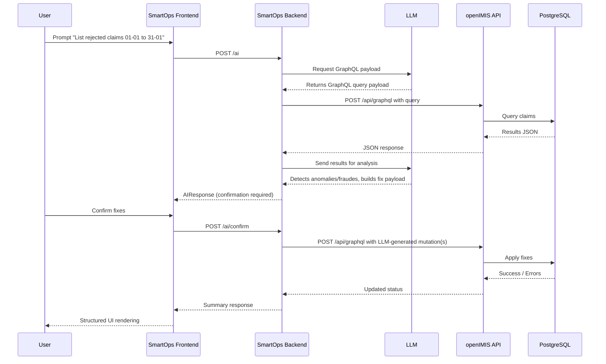

## SmartOps AI

AI-native operational assistant for claims, families, and tickets. Not a chatbot – each run is a structured operational analysis with tool-backed recommendations.

---

### Architecture Overview

- **Frontend**: `frontend/`
  - Next.js (App Router), React, TypeScript, Tailwind CSS.
  - Components:
    - `ChatWindow` – manages runs, streaming UX, auto-scroll, typing indicator.
    - `DynamicRenderer` – renders UI based on `ui_type` (`summary | table | suggestion | confirmation`).
    - `DataTable`, `ConfirmationCard`, `MessageBubble` – UI primitives for structured responses.
  - `lib/api.ts` – typed client and simulated streaming from the backend.
  - `types/ai.ts` – shared UI response contract.

- **Backend**: `backend/`
  - FastAPI service exposing `/ai` and `/health`.
  - `ai/system_prompt.py` – single source of truth for LLM instructions and UI contract.
  - `ai/schemas.py` – Pydantic models for `AIRequest`, `AIResponse`, `SuggestedAction`, and `UIType`.
  - `ai/tools.py` – modular tools:
    - `list_rejected_claims`
    - `fix_invalid_claim_dates` (dry-run-only by default)
    - `list_large_families`
  - `ai/orchestrator.py` – orchestration layer that decides which tools to call and shapes a UI response.

This separation keeps **AI orchestration** and **business logic** decoupled, and the frontend consumes a clean, typed UI protocol instead of free-form text.

---

### AI-Native Design

- **Tool-first, not chat-first**:
  - User queries are routed to tools (claims, families, anomaly checks).
  - Tools return structured, domain-specific results.
  - Orchestrator converts those results into a UI-oriented JSON shape.
- **UI contract**:
  - Every AI response respects:
    - `ui_type: "summary" | "table" | "suggestion" | "confirmation"`
    - `title: string`
    - `message: string`
    - `data: Record<string, unknown>[]`
    - `suggested_actions: { label, description, payload }[]`
  - The React frontend **renders components dynamically** from this contract, so new behaviors can be added on the backend without rewriting the UI.
- **Proactive behavior**:
  - On load, the frontend triggers a **proactive anomaly overview** rather than waiting for a chat message.
  - The orchestrator aggregates tool outputs into a snapshot of anomalies (rejections, invalid dates, large families).

---

### Tool Calling Model

- Tools are defined in `backend/ai/tools.py` with:
  - **Pure functions** operating on an in-memory context (`ToolContext`).
  - A `TOOLS_REGISTRY` describing tool parameters and purpose (suitable for LLM function calling in a real setup).
  - A `call_tool(name, args)` dispatcher.
- Safety constraints:
  - `fix_invalid_claim_dates` runs as a **dry-run** by default and **never mutates** data.
  - Any real mutation would require:
    - A `confirmation`-typed response from the orchestrator, and
    - An explicit user action handled via `SuggestedAction`.
- The orchestrator (`ai/orchestrator.py`) currently uses deterministic rules to:
  - Map natural language queries to tools.
  - Combine multiple tool outputs into overviews.
  - Emit suggested actions that encode **next-best operations** in `payload`.

In production, you would swap the rule engine with an LLM using `BASE_SYSTEM_PROMPT` and `TOOLS_REGISTRY` for function calling.

---

### RAG-Ready Structure

SmartOps AI is designed so retrieval can be plugged in without disturbing the UI:

- **Where to plug RAG**:
  - Add a `retrievers/` or `data/` module under `backend/` that:
    - Connects to your vector store (claims notes, tickets, policies).
    - Exposes retrieval functions like `retrieve_related_tickets(claim_id)` or `retrieve_policy_context(family_id)`.
  - Call these from `ai/orchestrator.py` before or after tools to enrich context.
- **How it fits**:
  - Retrieved context becomes **additional `data` rows** or **explanatory fields** in `AIResponse`.
  - No frontend change is needed as long as you honor the same `AIResponse` shape.

---

### Why This Is Not a Basic Chatbot

- There is **no generic chat history UI**; instead:
  - Each interaction is framed as an **operational run** with clearly defined tools.
  - The UI emphasizes tables, summaries, and confirmations — not long-form text.
- The assistant:
  - **Calls tools** to inspect operational data (claims, families).
  - Returns **structured, typed JSON** consumed by a dynamic renderer.
  - Surfaces **proactive suggestions** for follow-up analyses and safe write operations.

The result is an **AI control panel**, not a conversational toy.

---

### Installation & Run Instructions

#### Backend (FastAPI)

```bash
cd backend
python -m venv .venv
source .venv/bin/activate  # On Windows: .venv\\Scripts\\activate
pip install -r requirements.txt

uvicorn main:app --reload --host 0.0.0.0 --port 8000
```

The backend exposes:
- `GET /health` – basic health check.
- `POST /ai` – main AI orchestration endpoint.

#### Frontend (Next.js)

```bash
cd frontend
pnpm install  # or: npm install / yarn install

export NEXT_PUBLIC_BACKEND_URL="http://localhost:8000"
pnpm dev      # or: npm run dev / yarn dev
```

Then open `http://localhost:3000` in your browser.

---

### Example Prompts to Test

- **Proactive anomalies** (also runs automatically on load):
  - “Run proactive anomaly overview”
  - “Show me an anomaly snapshot for claims and families”
- **Rejected claims**:
  - “Show me rejected claims with details”
  - “List all rejected claims and their amounts”
- **Invalid claim dates**:
  - “Simulate fixing invalid claim dates”
  - “Find claims with future service dates and propose corrections”
- **Large families**:
  - “Show large families driving claim volume”
  - “List all families with more than 5 members”

Use the **suggestion buttons** in the UI to chain analyses and explore how SmartOps AI orchestrates tools and returns structured responses.

### Architecture





## System Integration

SmartOps operates as an AI orchestration layer on top of openIMIS.

- No direct database access
- All business logic enforced by openIMIS
- JWT token forwarding for RBAC
- Tool-first AI design
- Structured UI protocol (AIResponse contract)

